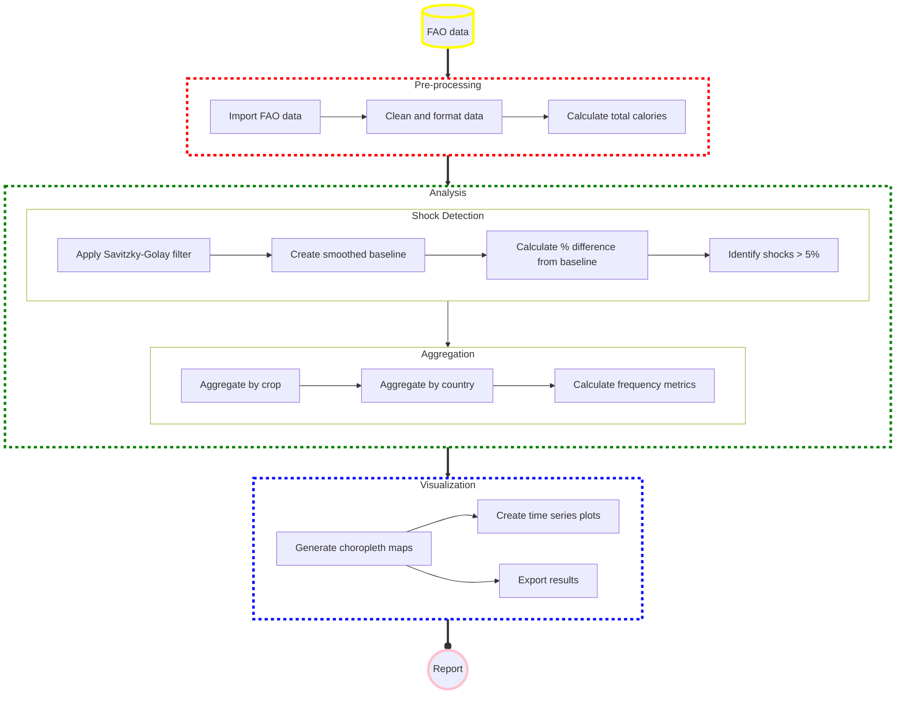

# Historical-Food-Shocks

[](https://opensource.org/licenses/Apache-2.0) 

## What this is and what it can be used for

Historical-Food-Shocks analyzes the frequency and magnitude of food production shocks at the country level. This project aims to demonstrate that food production shocks meeting the Global Catastrophic Food Failure (GCFF) threshold of 5% occur regularly at national scales, suggesting that global-scale events of similar magnitude are plausible and require preparation.

The analysis uses data from the Food and Agriculture Organization of the United Nations (FAO) to estimate how much each year's yield deviates from expected trends, focusing on major crops (corn, rice, wheat, and soy) that account for approximately two-thirds of global calorie production.

By visualizing historical shock patterns through choropleth maps, this project grounds future catastrophic food security risks in historical data, challenging the perception that GCFF-scale events are merely theoretical.

## Installation

To install the Historical-Food-Shocks package, we recommend setting up a virtual environment using the following steps:

* Create a virtual environment using conda by running the command `conda env create -f environment.yml`. This will create an environment called "food-shocks".

* Activate the environment by running `conda activate food-shocks`.

* Install the package by running `pip install -e .` in the main folder of the repository.

* To run the Jupyter notebooks, you'll need to create a kernel for the environment:
  - Install the necessary tools: `conda install -c anaconda ipykernel`
  - Create the kernel: `python -m ipykernel install --user --name=food-shocks`

You can now use the kernel "food-shocks" to run the example notebooks or analyze the data yourself.

## How to use this

The main interface of the analysis is provided through the scripts in the `scripts` directory. The analysis process consists of:

1. Loading and preprocessing the FAO data
2. Calculating smoothed yield baselines using a Savitzky-Golay filter
3. Identifying irregular fluctuations (shocks) by comparing actual yields to the smoothed baseline
4. Aggregating crops on a calorie basis to evaluate total calorie production shocks
5. Visualizing results through choropleth maps and time series plots

Example usage can be found in the Jupyter notebooks located in the `scripts` directory.

### Running the analysis with custom parameters

You can customize the analysis by modifying parameters such as:

- Window length and polynomial order for the Savitzky-Golay filter
- Shock threshold values (default is 5%)
- Specific crops to include in the analysis
- Date range for the analysis

### Visualizing results

The package includes various visualization tools to represent food production shocks:

- Choropleth maps showing shock magnitudes across countries
- Time series plots of shocks for specific countries or regions
- Comparison views of different crops or time periods

## Getting the data

The repository comes with recent versions of the FAO data, but if you need the most up-to-date information, you can download the data from the FAO:
1. [Production data](http://www.fao.org/faostat/en/#data/QC)
2. [Population data](http://www.fao.org/faostat/en/#data/OA) (if analyzing per capita figures)

## Project Structure

```
Historical-Food-Shocks/
├── .github/workflows/    # GitHub Actions workflows for CI/CD
├── data/                 # Data files from FAO and processed datasets
├── docs/                 # Documentation files
├── results/              # Generated analysis results and visualizations
├── scripts/              # Analysis scripts and Jupyter notebooks
├── src/                  # Source code for the analysis package
├── tests/                # Test suite for the code
├── .flake8               # Configuration for linting
├── .gitignore            # Git ignore file
├── LICENSE               # Project license
├── README.md             # This file
├── automate_mkdocs.py    # Script to update documentation
└── environment.yml       # Conda environment specification
```

## Having problems?

If you encounter any issues, feel free to open an issue in the repository or contact the maintainers.

## Flowchart


